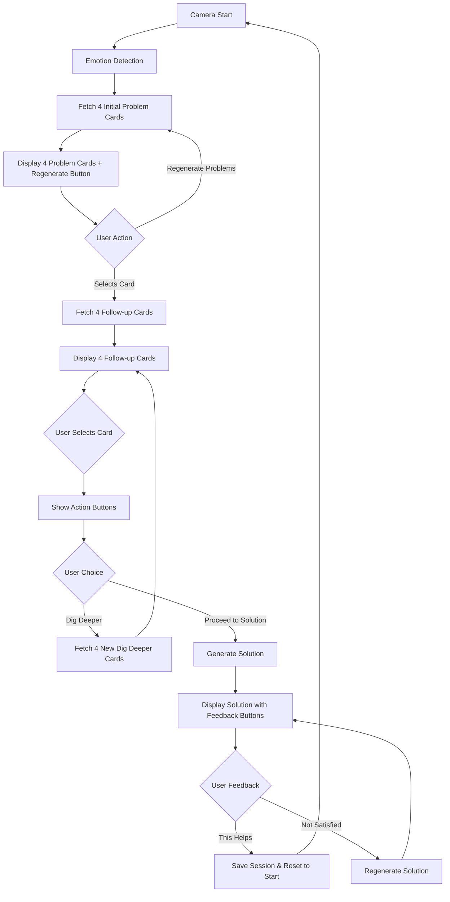

# Design Document

## Overview

The frontend conversation flow integrates with the existing Lumi emotion detection system to create a complete interactive experience. The design builds upon the already-implemented camera and emotion detection features, adding multi-level AI conversation capabilities with context-aware prompts and personalized solutions.

The system follows a state-driven architecture where the UI transitions through distinct phases: emotion detection → 4 initial problem cards → 4 follow-up cards → action decision (dig deeper/proceed) → solution delivery → feedback (helps/not satisfied) → session reset. Each stage presents exactly 4 picture cards to help narrow down the problem. Users can regenerate the problem list if their issue isn't shown. Each phase is managed through React state and animated transitions using Framer Motion.

## Architecture

### Component Structure

```
StartPage (Main Container)
├── Camera/Video Display (Existing)
├── Emotion Detection Display (Existing)
├── PictureCards Component (Existing - displays 4 cards)
├── RegenerateButton Component (New - for problem list regeneration)
├── ActionButtons Component (New - Already Created)
├── SolutionDisplay Component (New - Already Created)
└── Loading States
```

### State Management Architecture

The application uses React's useState hooks for local state management with the following state categories:

**Profile & Context States:**
- `childProfile`: ChildProfile object from Supabase
- `childRoutine`: Child's daily routine data from Supabase
- `loading`: Initial profile loading state

**Emotion Detection States (Existing):**
- `isRecording`: Camera recording status
- `emotion`: Detected emotion string
- `confidence`: Emotion confidence score (0-1)
- `countdown`: 10-second timer for detection
- `error`: Error messages

**Conversation Flow States:**
- `showCards`: Boolean to display PictureCards
- `prompts`: Array of exactly 4 PromptOption objects
- `previousProblems`: Array of previously shown problem labels (for regeneration)
- `sessionId`: UUID for current session
- `promptType`: "initial" | "followup" to track conversation level
- `loadingPrompts`: Loading state for API calls
- `conversationHistory`: Array of user selections
- `interactionDepth`: Counter for conversation depth
- `showRegenerateButton`: Boolean to show problem regeneration option

**Action & Solution States:**
- `showActionButtons`: Boolean to display ActionButtons component
- `showSolution`: Boolean to display SolutionDisplay component
- `solution`: Generated solution text

### Data Flow



## Components and Interfaces

### 1. StartPage Component (Main Container)

**Responsibilities:**
- Manage all application state
- Orchestrate conversation flow
- Handle API communication with Gemini Service
- Persist session data to Supabase
- Coordinate component rendering based on state

**Key Methods:**

```typescript
// Profile & Context Loading
loadProfile(): Promise<void>
  - Fetches child profile from Supabase
  - Fetches child routine from Supabase
  - Redirects if data missing

getCurrentTime(): string
  - Returns current time in HH:MM 24-hour format

// Prompt Fetching
fetchInitialPrompts(): Promise<void>
  - POST to /api/prompts/initial
  - Includes emotion, child_profile, child_routine, current_time
  - Creates session in database
  - Sets prompts (4 cards) and sessionId state
  - Stores problem labels in previousProblems
  - Shows regenerate button

handleRegenerateProblems(): Promise<void>
  - POST to /api/prompts/regenerate-problems
  - Includes session_id, emotion, previous_problems, child_profile, child_routine, current_time
  - Receives 4 new alternative problem cards
  - Updates prompts state with new cards
  - Appends new problems to previousProblems

fetchFollowupPrompts(selectedOption: string): Promise<void>
  - POST to /api/prompts/followup
  - Includes session_id, selected_option, conversation context
  - Updates prompts state with 4 follow-up cards
  - Stores interaction in database
  - Hides regenerate button

// Conversation Actions
handleCardSelect(selectedLabel: string): Promise<void>
  - Adds selection to conversation history
  - Routes to follow-up or action buttons based on promptType
  - Hides regenerate button after selection

handleDigDeeper(): Promise<void>
  - POST to /api/prompts/dig-deeper
  - Includes full conversation history and context
  - Increments interaction depth
  - Shows 4 new prompt cards

handleProceedToSolution(): Promise<void>
  - POST to /api/solution/generate
  - Includes conversation history and context
  - Displays solution component
  - Updates session with solution

// Solution Feedback
handleSatisfied(): Promise<void>
  - Updates session with satisfaction status
  - Creates session summary
  - Marks session as completed
  - Resets ALL state variables to initial values
  - Returns to start screen (ready for new session)

handleNotSatisfied(): Promise<void>
  - POST to /api/solution/regenerate
  - Includes previous solution and conversation context
  - Updates displayed solution
  - Allows user to provide feedback again

// Database Operations
createSession(sessionId: string): Promise<void>
  - Inserts session record with initial emotion data

storeInteraction(selected: string, prompts: PromptOption[], type: string): Promise<void>
  - Inserts interaction record with order tracking
```

### 2. ActionButtons Component (Already Implemented)

**Props Interface:**
```typescript
interface ActionButtonsProps {
  onProceedToSolution: () => void;
  onDigDeeper: () => void;
}
```

**Responsibilities:**
- Display two action buttons with distinct styling
- Handle user choice between proceeding to solution or exploring deeper
- Provide visual feedback on hover/tap

**Styling:**
- Green gradient for "Proceed to Solution"
- Blue gradient for "Dig Deeper"
- Framer Motion animations for interactions

### 3. SolutionDisplay Component (Already Implemented)

**Props Interface:**
```typescript
interface SolutionDisplayProps {
  solution: string;
  emotion: string;
  onSatisfied: () => void;
  onNotSatisfied: () => void;
}
```

**Responsibilities:**
- Display generated solution text
- Provide satisfaction feedback buttons
- Handle user response to solution

**Styling:**
- Purple/pink gradient background
- Green button for "This Helps!"
- Orange button for "Try Again"
- Framer Motion animations

### 4. RegenerateButton Component (New)

**Props Interface:**
```typescript
interface RegenerateButtonProps {
  onRegenerate: () => void;
  loading: boolean;
}
```

**Responsibilities:**
- Display a button to regenerate problem list
- Show loading state during regeneration
- Only visible during initial problem display

**Styling:**
- Distinct styling to differentiate from picture cards
- Orange/amber gradient to indicate alternative action
- Framer Motion animations for interactions
- Text: "Not listed? Show me different problems"

### 5. PictureCards Component (Existing)

**Props Interface:**
```typescript
interface PictureCardsProps {
  prompts: PromptOption[];
  onSelect: (label: string) => void;
  emotion: string;
}
```

**Responsibilities:**
- Display AI-generated prompt options as cards
- Handle card selection
- Show emotion context

## Data Models

### PromptOption Interface

```typescript
interface PromptOption {
  label: string;        // Short title for the card
  description: string;  // Detailed explanation
  reasoning?: string;   // Optional AI reasoning (not displayed)
}
```

### ChildProfile Interface (Existing)

```typescript
interface ChildProfile {
  id: string;
  child_name: string;
  age: number;
  diagnosis: string;  // Note: Currently missing from type definition
  created_at: string;
}
```

### ChildRoutine Interface

```typescript
interface ChildRoutine {
  id: string;
  child_profile_id: string;
  morning_routine: string;
  afternoon_routine: string;
  evening_routine: string;
  favorite_activities: string[];
  triggers: string[];
  calming_strategies: string[];
  created_at: string;
}
```

### Session Database Schema

```sql
sessions {
  id: uuid (primary key)
  child_profile_id: uuid (foreign key)
  initial_emotion: text
  emotion_confidence: float
  solution_provided: text
  satisfaction_status: text ('satisfied' | 'not_satisfied' | null)
  session_summary: text
  status: text ('active' | 'completed')
  created_at: timestamp
  ended_at: timestamp
}
```

### SessionInteraction Database Schema

```sql
session_interactions {
  id: uuid (primary key)
  session_id: uuid (foreign key)
  interaction_order: integer
  prompt_type: text ('initial' | 'followup' | 'dig_deeper')
  selected_option: text
  prompt_options: jsonb
  interaction_depth: integer
  action_type: text
  created_at: timestamp
}
```

## API Integration

### Gemini Service Endpoints

**Base URL:** `http://localhost:8001`

#### 1. POST /api/prompts/initial

**Request Body:**
```typescript
{
  emotion: string;
  child_profile_id: string;
  confidence: number;
  child_profile: {
    child_name: string;
    age: number;
    diagnosis: string;
  };
  child_routine: ChildRoutine;
  current_time: string; // "HH:MM" format
}
```

**Response:**
```typescript
{
  prompts: PromptOption[];
  session_id: string;
}
```

#### 2. POST /api/prompts/regenerate-problems

**Request Body:**
```typescript
{
  session_id: string;
  emotion: string;
  previous_problems: string[]; // Labels of previously shown problems
  child_profile: { child_name, age, diagnosis };
  child_routine: ChildRoutine;
  current_time: string;
}
```

**Response:**
```typescript
{
  prompts: PromptOption[]; // 4 new alternative problem cards
}
```

**Note:** The Gemini service must ensure the new problems are different from those in previous_problems array.

#### 3. POST /api/prompts/followup

**Request Body:**
```typescript
{
  session_id: string;
  emotion: string;
  selected_option: string;
  child_profile_id: string;
  child_profile: { child_name, age, diagnosis };
  child_routine: ChildRoutine;
  current_time: string;
  interaction_depth: number;
  conversation_history: string[];
}
```

**Response:**
```typescript
{
  prompts: PromptOption[];
}
```

#### 4. POST /api/prompts/dig-deeper

**Request Body:**
```typescript
{
  session_id: string;
  emotion: string;
  conversation_history: string[];
  child_profile: { child_name, age, diagnosis };
  child_routine: ChildRoutine;
  current_time: string;
}
```

**Response:**
```typescript
{
  prompts: PromptOption[];
}
```

#### 5. POST /api/solution/generate

**Request Body:**
```typescript
{
  session_id: string;
  emotion: string;
  conversation_history: string[];
  child_profile: { child_name, age, diagnosis };
  child_routine: ChildRoutine;
}
```

**Response:**
```typescript
{
  solution: string;
}
```

#### 6. POST /api/solution/regenerate

**Request Body:**
```typescript
{
  session_id: string;
  emotion: string;
  conversation_history: string[];
  previous_solution: string;
  child_profile: { child_name, age, diagnosis };
  child_routine: ChildRoutine;
}
```

**Response:**
```typescript
{
  solution: string;
}
```

## UI/UX Flow

### Phase Transitions

The UI uses AnimatePresence from Framer Motion to smoothly transition between phases:

1. **Initial State**: Large "Lumi 🌟" title with Start button
2. **Recording State**: Video feed with countdown and live emotion display
3. **Problem Cards State**: 4 PictureCards + RegenerateButton for initial problems
4. **Follow-up Cards State**: 4 PictureCards for narrowing down the problem
5. **Action State**: ActionButtons component with "Proceed to Solution" and "Dig Deeper"
6. **Solution State**: SolutionDisplay component with "This Helps" and "Not Satisfied" buttons
7. **Loading State**: Spinner with "Thinking..." message
8. **Reset State**: Returns to Initial State after "This Helps" is clicked

### Conditional Rendering Logic

```typescript
{!isRecording && !showCards && !showActionButtons && !showSolution && (
  <StartButton />
)}

{isRecording && (
  <CameraView />
)}

{showCards && !loadingPrompts && (
  <>
    <PictureCards prompts={prompts} onSelect={handleCardSelect} emotion={emotion} />
    {showRegenerateButton && promptType === "initial" && (
      <RegenerateButton onRegenerate={handleRegenerateProblems} loading={loadingPrompts} />
    )}
  </>
)}

{showActionButtons && (
  <ActionButtons 
    onProceedToSolution={handleProceedToSolution} 
    onDigDeeper={handleDigDeeper} 
  />
)}

{showSolution && !loadingPrompts && (
  <SolutionDisplay 
    solution={solution}
    emotion={emotion}
    onSatisfied={handleSatisfied}
    onNotSatisfied={handleNotSatisfied}
  />
)}

{loadingPrompts && (
  <LoadingSpinner />
)}
```

### Animation Strategy

- **Entry animations**: Fade in with upward slide (y: 30 → 0)
- **Exit animations**: Fade out with downward slide (y: 0 → -30)
- **Button interactions**: Scale on hover (1.05) and tap (0.95)
- **Duration**: 0.5-0.6 seconds for smooth transitions

## Error Handling

### Error Categories

1. **Camera Access Errors**
   - NotAllowedError: Permission denied
   - NotFoundError: No camera available
   - NotReadableError: Camera in use
   - Generic: Other camera failures

2. **API Communication Errors**
   - Network failures
   - HTTP error responses
   - Timeout errors
   - Invalid response format

3. **Database Errors**
   - Profile not found
   - Routine not found
   - Session creation failure
   - Interaction storage failure

### Error Handling Strategy

**User-Facing Errors:**
- Display error message in red text below relevant UI element
- Provide actionable guidance (e.g., "Please allow camera access")
- Allow user to retry operation

**Silent Errors:**
- Log to console for debugging
- Continue operation with degraded functionality
- Example: Missing routine data doesn't block prompt generation

**Critical Errors:**
- Redirect to appropriate page (onboarding, routine setup)
- Prevent further interaction until resolved

### Error State Management

```typescript
const [error, setError] = useState<string>("");

// Clear error on new operation
setError("");

// Set error on failure
setError("Failed to load picture cards. Is Gemini service running on port 8001?");

// Display error
{error && (
  <p className="text-red-600 mt-4 text-sm">{error}</p>
)}
```

## Performance Considerations

### State Update Optimization

- Use functional updates for state that depends on previous value
- Example: `setInteractionDepth(prev => prev + 1)`
- Prevents stale closure issues

### API Call Management

- Set loading state before API calls
- Always clear loading state in finally block
- Prevent duplicate calls with loading state checks

### Memory Management

- Clean up camera stream on component unmount
- Clear intervals and timeouts on unmount
- Use useEffect cleanup functions

```typescript
useEffect(() => {
  return () => {
    stopCamera(); // Cleanup function
  };
}, []);
```

### Animation Performance

- Use transform properties (scale, translateY) for GPU acceleration
- Avoid animating layout properties
- Use AnimatePresence mode="wait" to prevent overlapping animations

## Testing Strategy

### Unit Testing

**Components to Test:**
- ActionButtons: Verify callbacks fire correctly
- SolutionDisplay: Verify callbacks and prop rendering
- RegenerateButton: Verify regeneration callback and loading state
- StartPage utility functions: getCurrentTime(), state updates

**Test Cases:**
- Button click handlers
- Prop validation
- State transitions
- Time formatting
- Problem regeneration logic
- Previous problems tracking

### Integration Testing

**Flows to Test:**
1. Complete happy path: Camera → Emotion → 4 Initial Problems → Select → 4 Follow-ups → Select → Action → Solution → This Helps → Reset
2. Problem regeneration flow: Camera → Emotion → 4 Initial Problems → Regenerate → 4 New Problems → Select → Continue
3. Dig deeper flow: Camera → Emotion → Initial → Follow-up → Dig Deeper → 4 New Cards → Solution
4. Regenerate solution flow: Solution → Not Satisfied → New Solution → This Helps
5. Multiple dig deeper levels: Test going 3-4 levels deep
6. Error handling: API failures, missing data

**Test Environment:**
- Mock Supabase client
- Mock fetch for API calls
- Mock navigator.mediaDevices for camera

### Manual Testing Checklist

- [ ] Camera permission flow
- [ ] Emotion detection accuracy
- [ ] Initial prompts show exactly 4 problem cards
- [ ] Regenerate button appears with initial problems
- [ ] Regenerate problems generates 4 new different problems
- [ ] Follow-up prompts show exactly 4 cards
- [ ] Dig deeper generates exactly 4 new prompts
- [ ] Solution is contextually appropriate
- [ ] "This Helps" completes session and resets to start
- [ ] "Not Satisfied" regenerates solution
- [ ] Can regenerate solution multiple times
- [ ] Session resets properly after completion
- [ ] Session data persists correctly
- [ ] Error messages display appropriately
- [ ] Loading states show during API calls
- [ ] Animations are smooth
- [ ] Mobile responsiveness

## Security Considerations

### Data Privacy

- Child profile data only sent to local backend (localhost:8001)
- No external API calls with personal information
- Session data stored in Supabase with proper access controls

### Input Validation

- Validate emotion string before API calls
- Ensure child profile exists before operations
- Check for null/undefined values before accessing properties

### API Security

- Backend should validate all incoming requests
- Rate limiting on API endpoints
- CORS configuration for localhost development

## Deployment Considerations

### Environment Variables

```env
NEXT_PUBLIC_SUPABASE_URL=<supabase-url>
NEXT_PUBLIC_SUPABASE_ANON_KEY=<supabase-key>
```

### Service Dependencies

1. **Emotion Backend**: http://localhost:8000
   - Emotion detection service
   - Must be running before camera use

2. **Gemini Service**: http://localhost:8001
   - AI prompt and solution generation
   - Must be running before emotion detection completes

3. **Supabase**: Cloud or self-hosted
   - Database for profiles, routines, sessions
   - Must be accessible at all times

### Production Considerations

- Replace localhost URLs with production endpoints
- Add environment-based URL configuration
- Implement proper error boundaries
- Add analytics for conversation flow tracking
- Consider caching child routine data
- Implement retry logic for API failures

## Known Issues and Limitations

### TypeScript Issues

1. **Missing 'diagnosis' property**: ChildProfile interface needs to be updated to include diagnosis field
2. **Null safety**: Multiple instances of 'childProfile' possibly null errors need proper null checks

### Functional Limitations

1. **Single session at a time**: No support for pausing/resuming sessions
2. **No conversation history UI**: Users can't review previous selections during the session
3. **Limited error recovery**: Some errors require page refresh
4. **No offline support**: Requires active internet connection
5. **Fixed card count**: Always generates exactly 4 cards per stage (not configurable)
6. **No limit on regenerations**: Users can regenerate problems indefinitely (may need rate limiting)

### Future Enhancements

1. Add conversation history visualization showing the path taken
2. Implement session pause/resume functionality
3. Add voice input option for card selection
4. Support multiple languages
5. Add parent dashboard for session review and pattern analysis
6. Implement progressive web app features
7. Add accessibility improvements (screen reader support)
8. Implement conversation branching visualization
9. Add rate limiting for problem regeneration
10. Allow configurable card count (4, 6, or 8 options)
11. Add "Go Back" functionality to previous card selection
12. Implement smart problem caching to avoid duplicate regenerations
